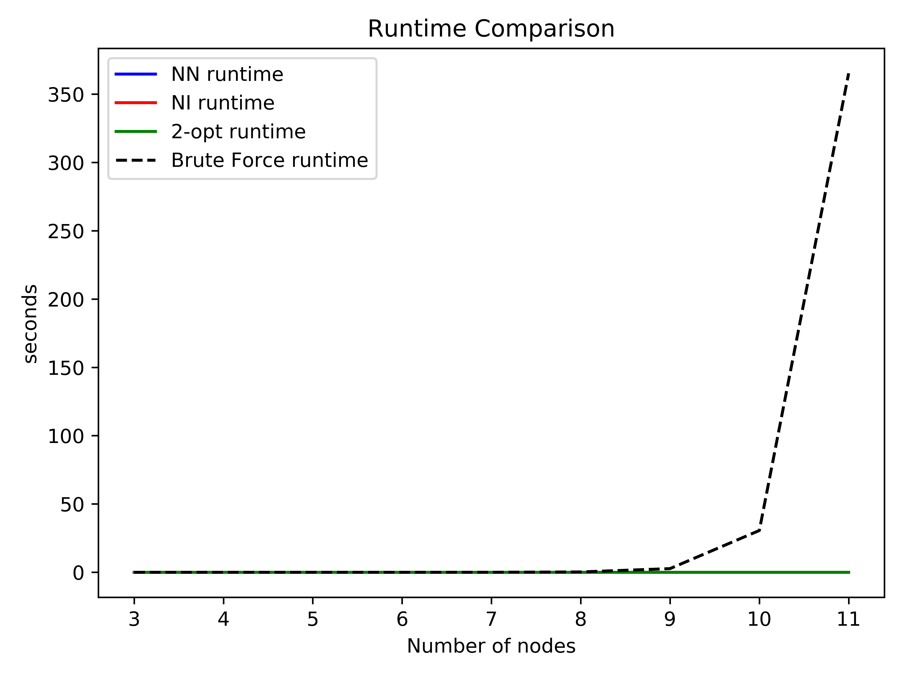
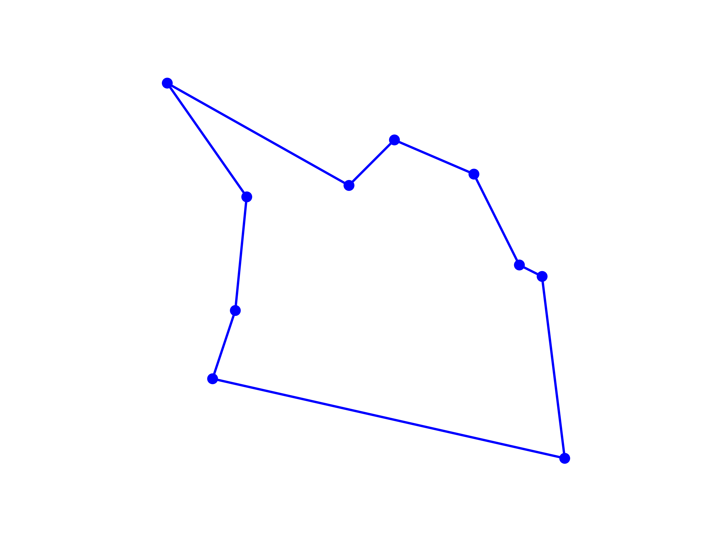
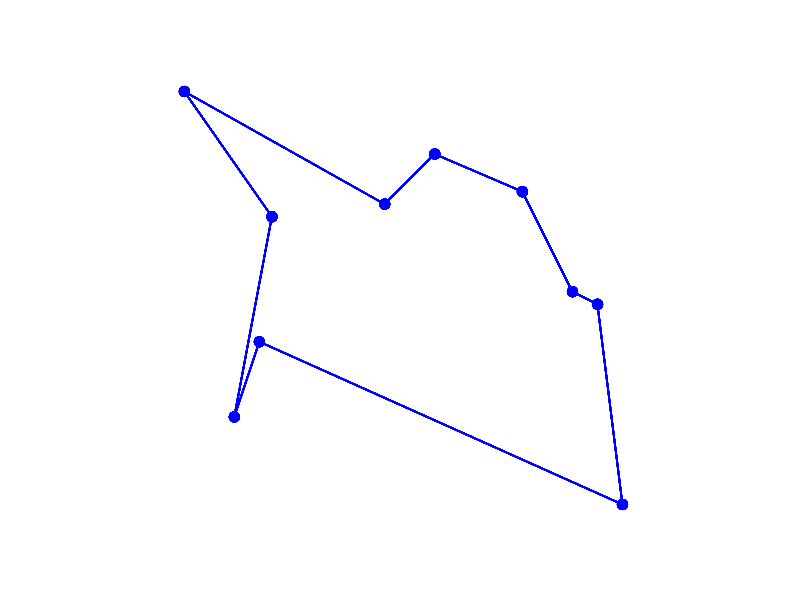
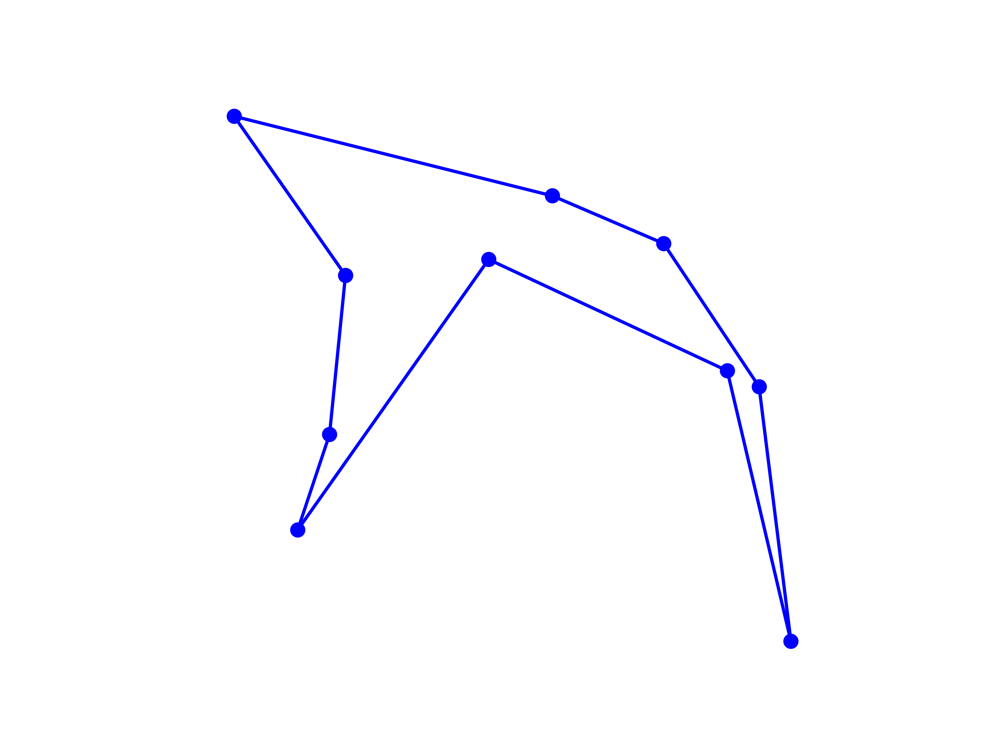
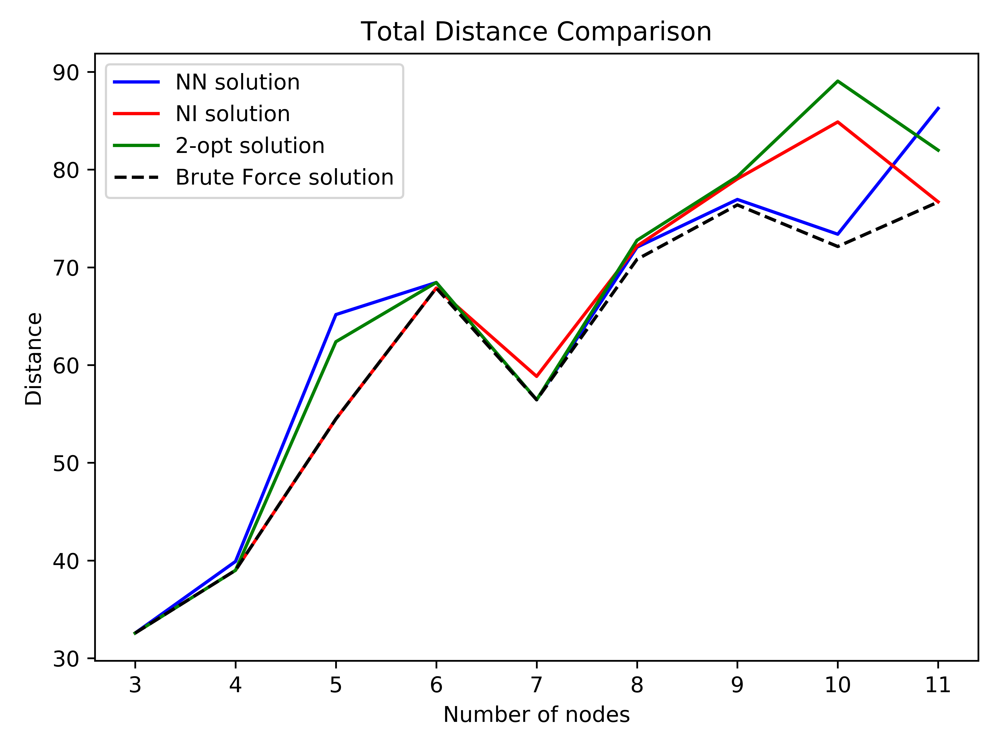
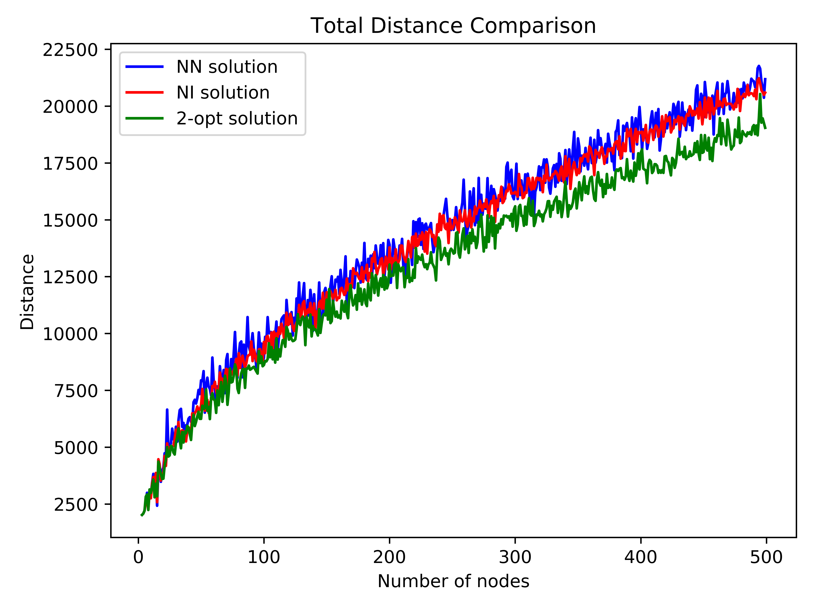

# Travelling Saleman Problem (TSP)
This project is to compare between 4 algorithms: Brute Force, Nearest Neighbor (NN), Nearest Insertion (NI) and 2-OPT for solving the Travelling Saleman Problem (TSP).

The TSP can be stated as 
>Given a set of cities, what is the shortestroute that visits each city only once and return to the starting city?

The Brute Force can give the optimal solution but its time complexity is O(n!) which is too high to afford in a regular machine. 

# Result Example
Brute Force           |  NN
:-------------------------:|:-------------------------:
  |  

NI          |  2-OPT
:-------------------------:|:-------------------------:
  |  

# Runtime comparison
* Brute Force vs 3 other algorithms: NN, NI, and 2-OPT

* NN, NI, and 2-OPT

# Solution Comparison
* Brute Force vs 3 other algorithms: NN, NI, and 2-OPT

* NN, NI, and 2-OPT

